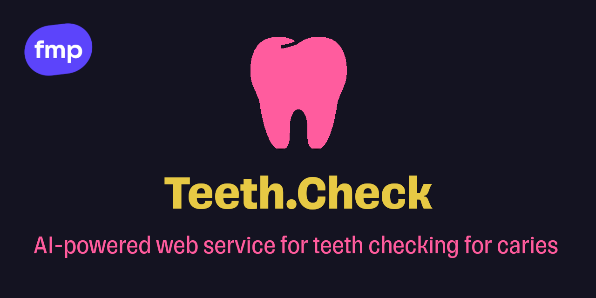
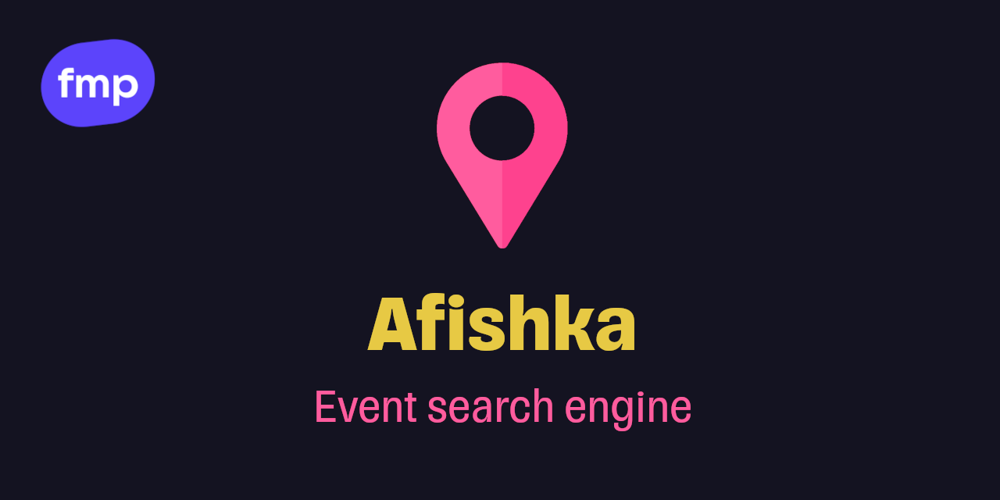
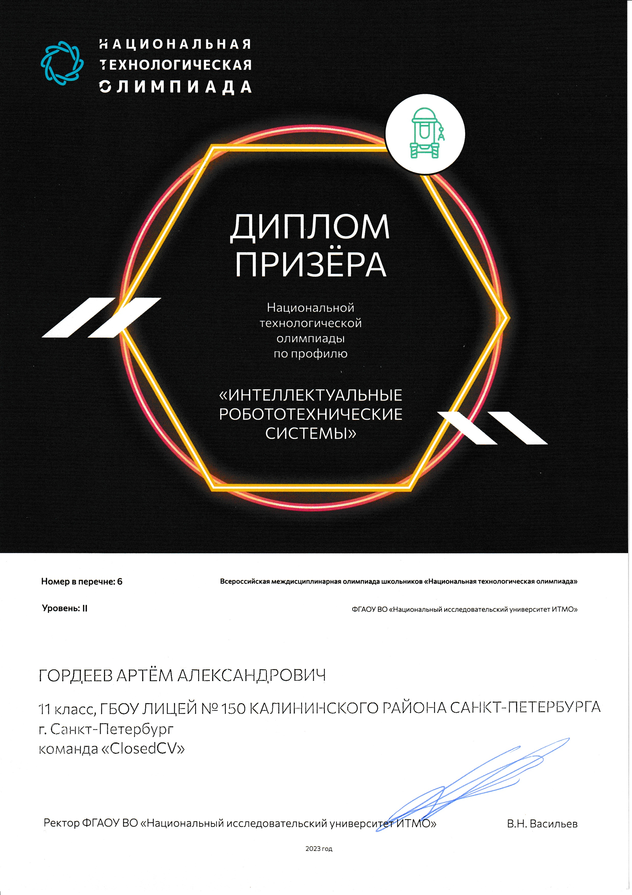
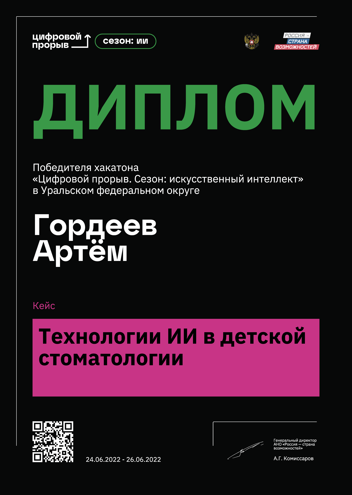

# Hi :wave:, I'm Artem Gordeev

## 📋 My projects

<table>
  <tr>
    <td></td>
    <td></td>
  </tr>
</table>

## 📊 Stats

<table>
  <tr>
    <td>
      
    </td>
    <td>
      
    </td>
  </tr>
</table>

## Certificates

<table>
  <tr>
    <td rowspan="2">
     
    </td>
    <td>
     
    </td>
  </tr>
</table>
